# dotfiles

CyberVarun config/dot files

# Take Backup before you install anything.

If you don't want loose your previous configurations, then pls take backup of previous configurations.

## ⚠️ Important 

Installing config files with `stow` will create symlinks of files and directory of cloned repository. So if you delete the cloned repository the config files will no longer work. If you don't want to let this happen then simply copy paste the files & directory manually.

## Requirements

Debian, Ubuntu based etc.

```
sudo apt install stow -y
```

Fedora, RedHat based etc.

```
sudo dnf install stow -y
```

Arch, Manjaro based etc.

```
sudo pacman -S stow -y
```

## Neovim config

To install execute

```
stow nvim
```

This will install the nvim configurations in `~/.config/nvim` directory.

To get familiar and understand keybindings you can watch this [video](https://youtu.be/6pAG3BHurdM).

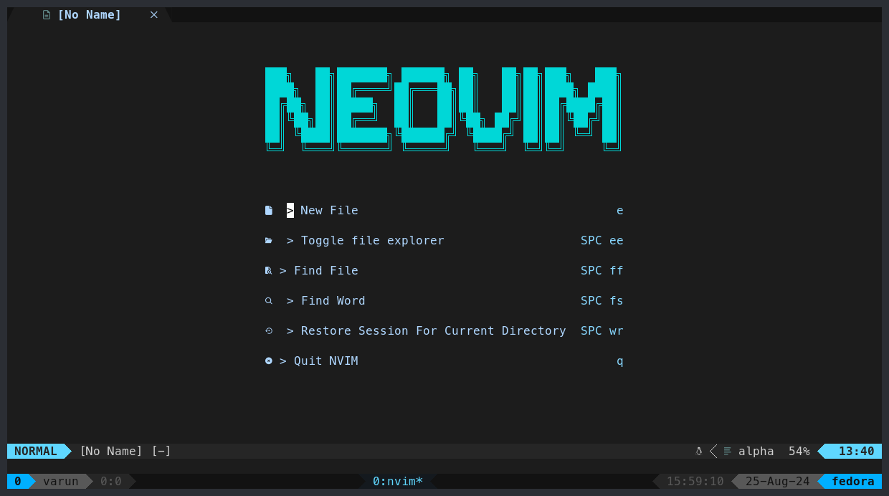

## Tmux config

Before installation you should install `tpm` using following command.

```
git clone https://github.com/tmux-plugins/tpm ~/.tmux/plugins/tpm
```

To install execute

```
stow tmux
```

This will install the tmux configurations in `~/.config/tmux` & in user home directory `~/.tmux.conf`. If you are using arch based distro you can remove `rm ~/.tmux.conf` or else remove `rm -f ~/.config/tmux` for other distros like ubuntu & fedora etc. So there will be no conflict of duplicate files.

After this open tmux by following command.

```
tmux
```

Then install the themes and plugins by pressing `[CTRL + a] + I`.

for understanding tmux keybindings you watch this [video](https://youtu.be/U-omALWIBos).

## ZSH config

### Requirements. 

- [powerlevel10k](https://github.com/romkatv/powerlevel10k)
- zsh-autosuggestions
- zsh-syntax-highlighting
- fzf
- zoxide
- eza
- bat
- [Meslo nerd font](https://www.nerdfonts.com/font-downloads)

If you are on Ubuntu download the latest version from github repository of tools.

⚠️ The following zsh configurations are created for fedora. It can work on other distros but don't forget to change the aliases according to you distros. 

To install execute.

```
stow zsh
```

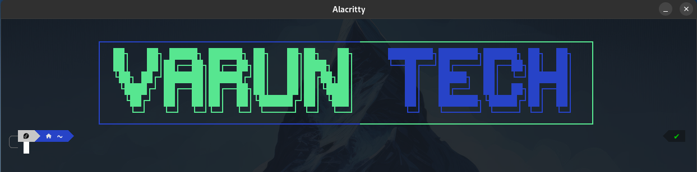

## Fedora Hyprland

Hyprland configuration for fedora.

Requirements.

- Hyprland 
- Hyprpaper
- Hyprlock
- Hyprpanel
- Waybar
- Wofi
- Wlogout
- WezTerm
- [Meslo nerd font](https://www.nerdfonts.com/font-downloads)

To install execute.

```
stow hypr wofi waybar wlogout
```

Hyperpanel configurations

Import the [config](https://github.com/CyberVarun/dotfiles/tree/main/hyprpanel) in Hyperpanel customizations and themeing section.

<details>
<summary>Hyperland with Hyperpanel Preview</summary>


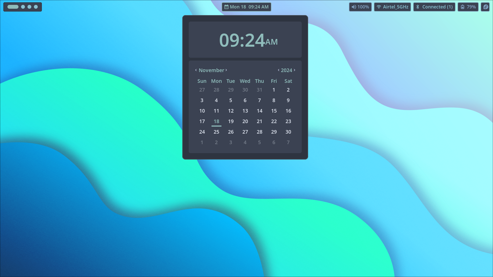
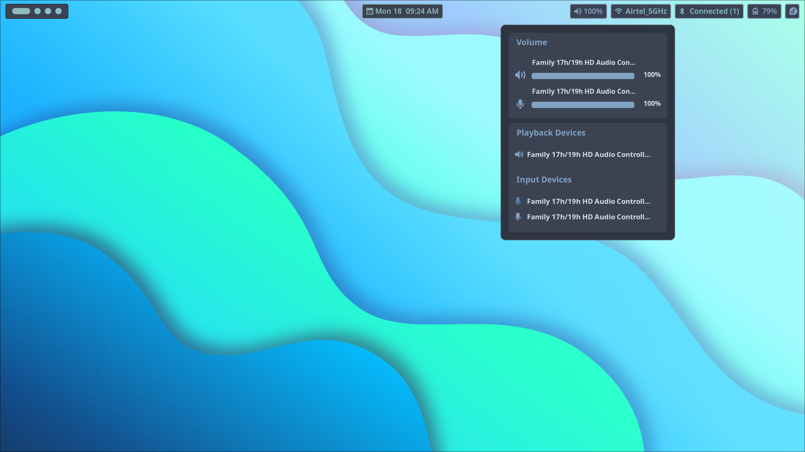
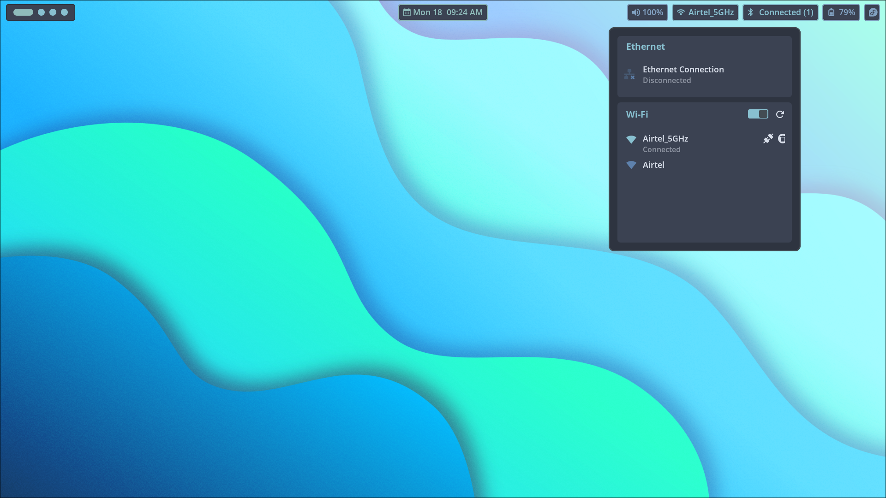
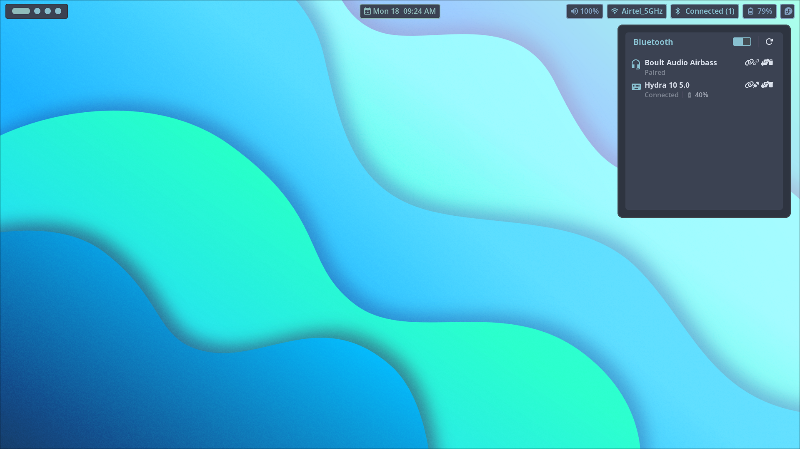
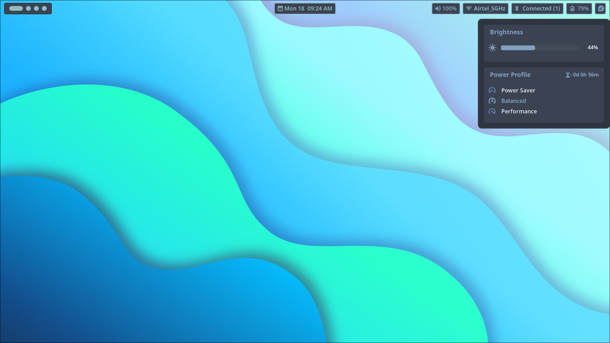
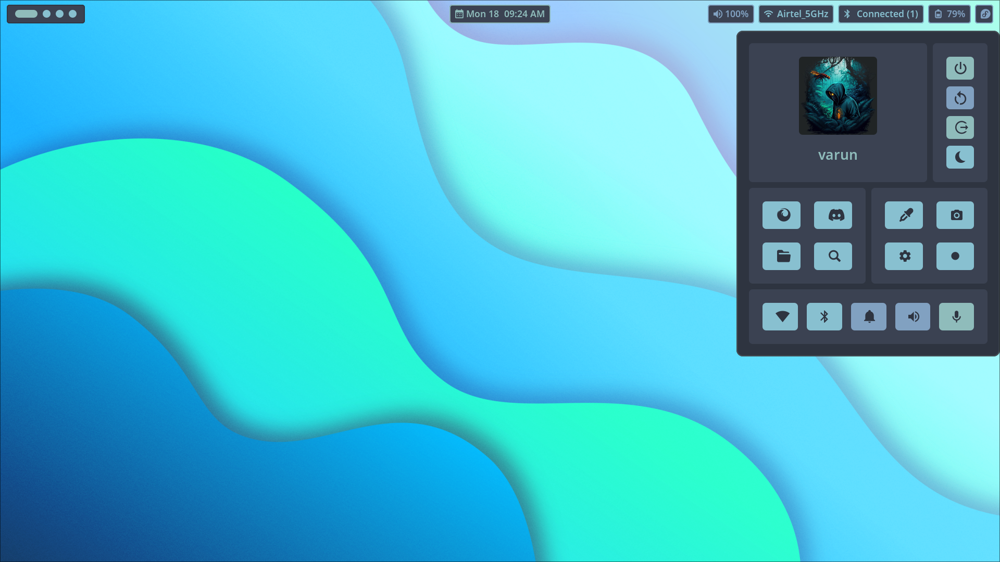
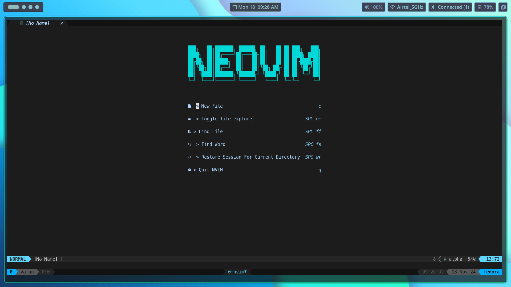
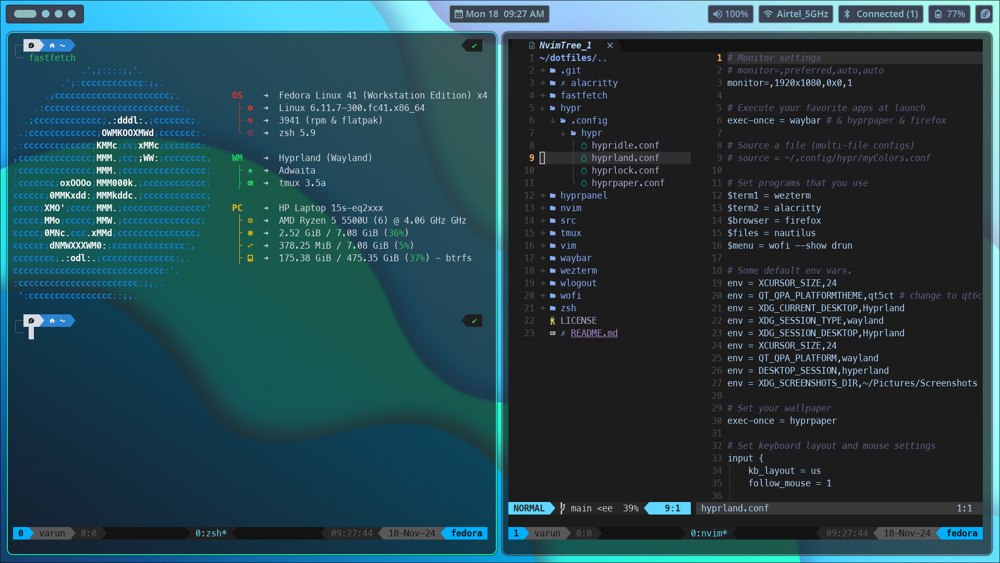
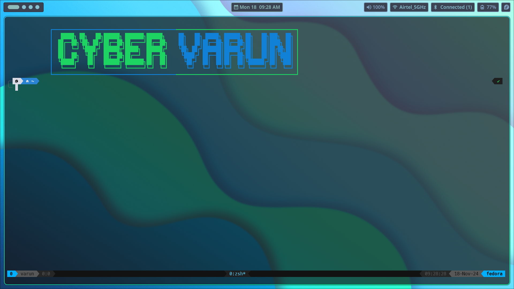

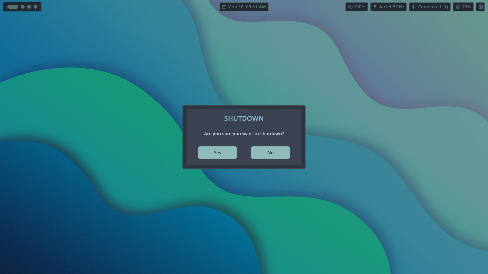
</details>

<details>
<summary>Wofi Preview</summary>

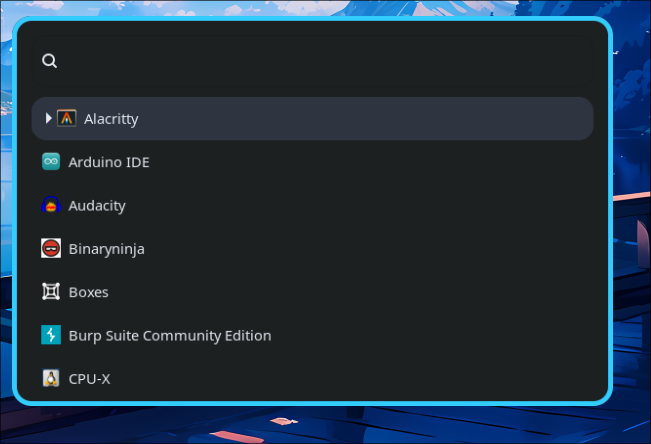
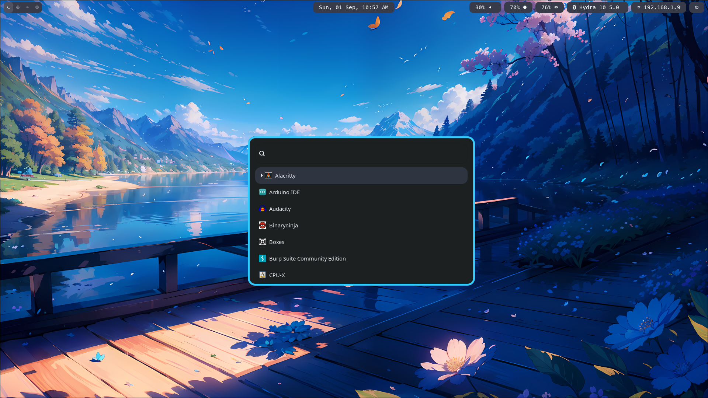
</details>

<details>
<summary>Waybar Preview</summary>

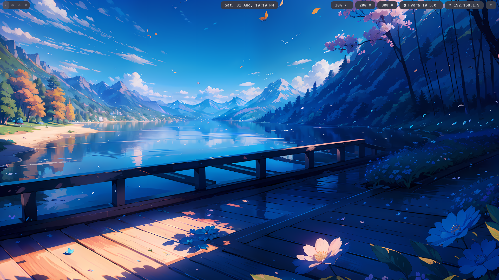
</details>

<details>
<summary>Wlogout Preview</summary>

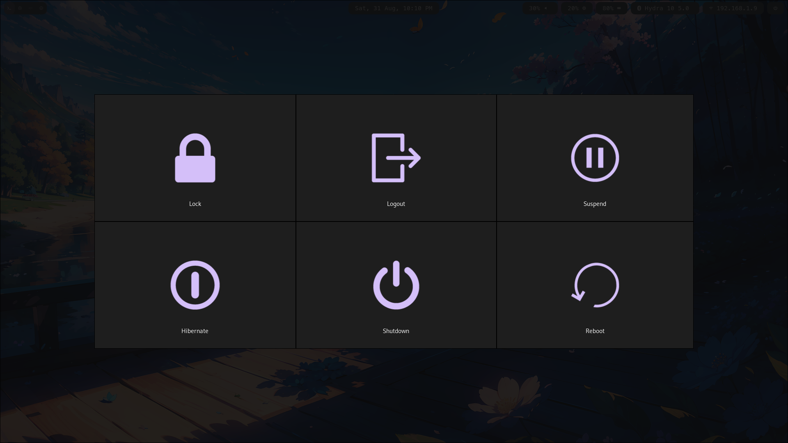
</details>


## Alacritty

Debian, Ubuntu based etc.

```
sudo apt install alacritty -y
```

Fedora, RedHat based etc.

```
sudo dnf install alacritty -y
```

Arch, Manjaro based etc.

```
sudo pacman -S alacritty -y
```

Requirements
  - [Meslo nerd font](https://www.nerdfonts.com/font-downloads)
  - Any terminal with `xterm-256color` support.

⚠️ The following alacritty configurations are created for fedora (alacritty1) & endeavour OS (alacritty2). It might not work properly on other distros with the given configurations.

Install themes

```
cd ~/.config/alacritty
git clone https://github.com/alacritty/alacritty-theme themes
```

Custom theme - coolnight theme (default) - (optional) 

```
curl https://raw.githubusercontent.com/josean-dev/dev-environment-files/main/.config/alacritty/themes/themes/coolnight.toml --output ~/.config/alacritty/themes/themes/coolnight.toml
```

### Alacritty

To install execute.
```
stow alacritty
```

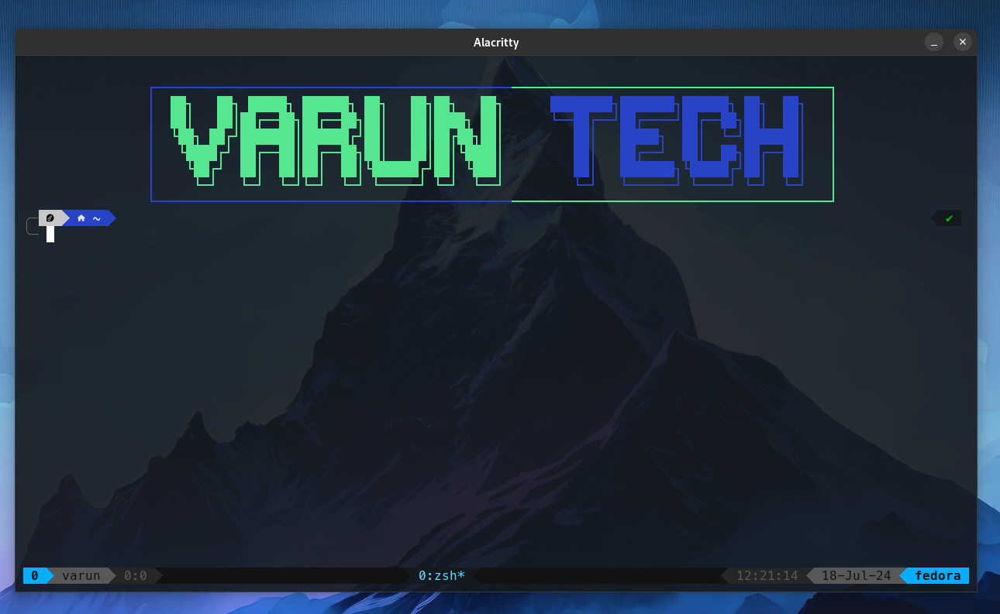
